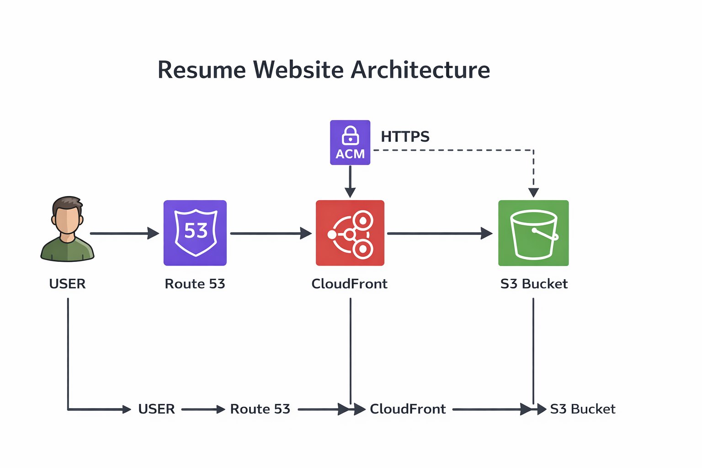
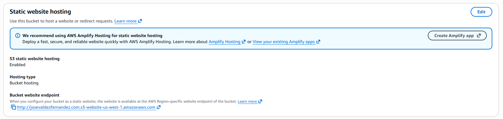
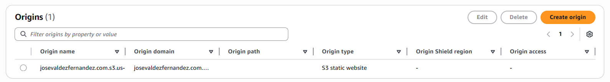

# Architecture Overview

This project is a personal resume website deployed using AWS cloud services. It is designed as a highly available, scalable, and secure static website.

---

## System Architecture Diagram

---

## AWS Services Used

### Amazon S3
- Stores my static website files (HTML, CSS, JavaScript)
- Configured for static website hosting
- Acts as the origin for CloudFront

### Amazon CloudFront
- Content Delivery Network (CDN)
- Distributes content globally for low latency
- Handles HTTPS requests for a secure connection
- This is the middle layer that serves the site quickly + securely

### Amazon Route 53
- Domain Name System (DNS) service
- Connects my domain (josevaldezfernandez.com) to where my website actually is
- Routes user requests to CloudFront

### AWS Certificate Manager (ACM)
- Provides SSL/TLS certificates
- Enables secure HTTPS connection
- This gives my site the lock icon (HTTPS)

---

## Request Flow

1. User enters the website domain in their browser (they search up: josevaldezfernandez.com)
2. Route 53 finds where the domain points and sends the request to the CloudFront distribution
3. CloudFront receives the request and checks the cache for the request or requests it from S3
4. S3 returns my website files to CloudFront
5. The website is returned to the user over HTTPS by CloudFront

In other words: The website is hosted in S3, distributed globally using CloudFront, accessed through a custom domain via Route 53, and secured with HTTPS using AWS Certificate Manager.

---

## Implementation Details

### S3 Static Hosting

- Static website hosting enabled
- Public access configured for website files

---

### CloudFront Distribution

- Origin set to S3 bucket
- HTTPS enabled using ACM
- Default root object set to `index.html`

---

### Route 53 Configuration

- Domain registered and hosted zone created
- A record points to CloudFront distribution

---

### SSL Certificate (ACM)

- Certificate issued for custom domain
- Attached to CloudFront distribution

---

## Design Decisions

- **S3** was chosen for cost-effective static hosting
- **CloudFront** improves performance and enables HTTPS
- **Route 53** provides reliable DNS routing
- **ACM** simplifies SSL certificate management

---

## Summary

This architecture provides:
- Low-cost hosting
- High availability
- Secure HTTPS communication
- Scalable global content delivery