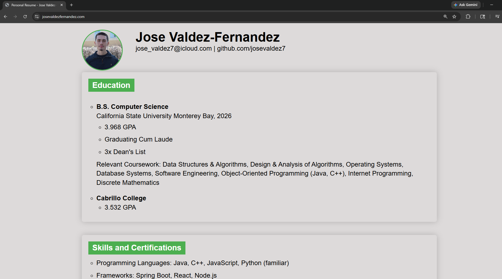
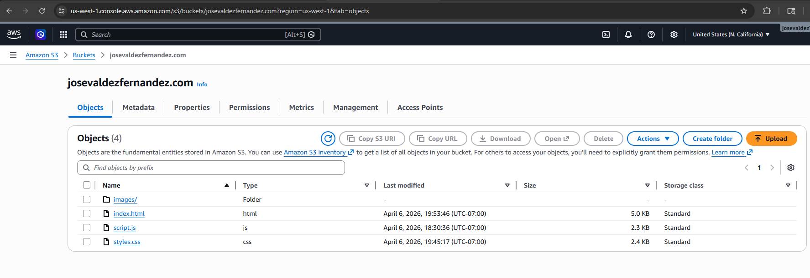
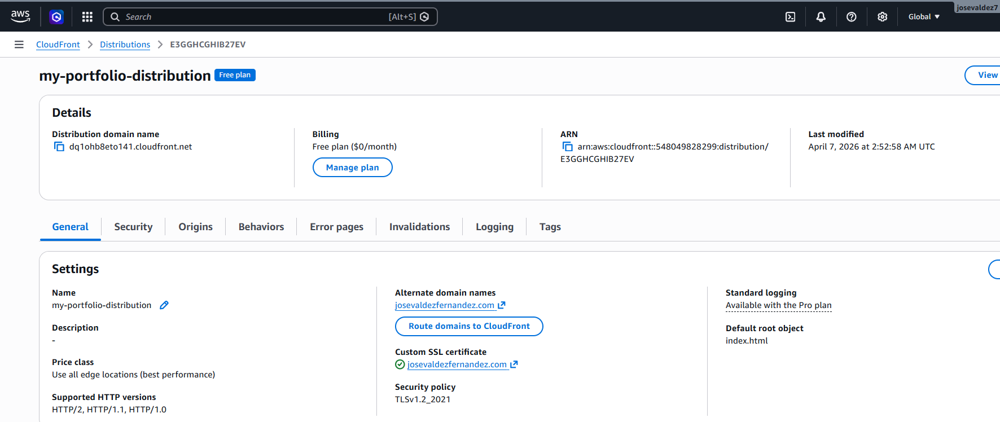
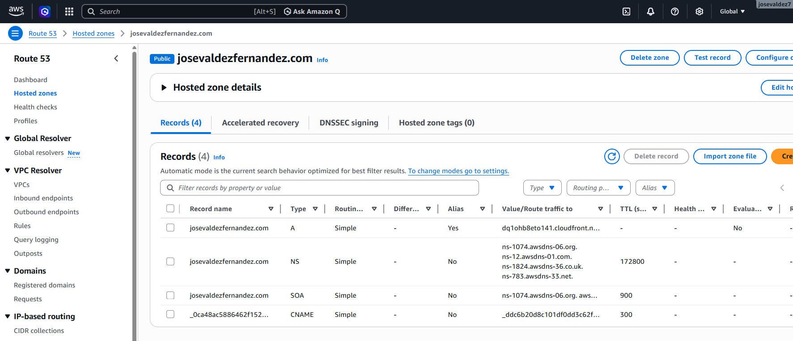
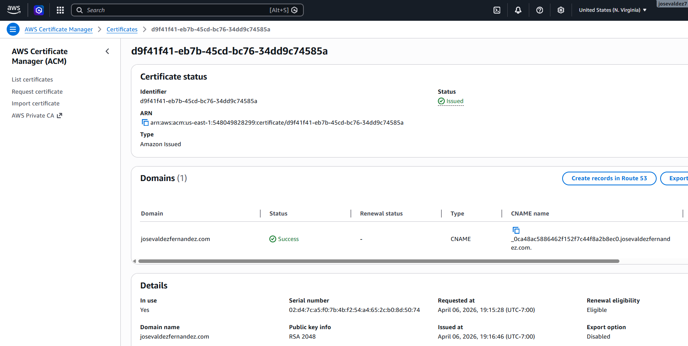

# Architecture Overview

This project is a personal resume website deployed using AWS cloud services. It is designed as a highly available, scalable, and secure static website.

---

## System Architecture Diagram

---

## AWS Services Used

### Amazon S3
- Stores static website files (HTML, CSS, JavaScript)
- Configured for static website hosting
- Acts as the origin for CloudFront

### Amazon CloudFront
- Content Delivery Network (CDN)
- Distributes content globally for low latency
- Handles HTTPS requests

### Amazon Route 53
- Domain Name System (DNS) service
- Routes user requests to CloudFront

### AWS Certificate Manager (ACM)
- Provides SSL/TLS certificates
- Enables secure HTTPS connection

---

## Request Flow

1. User enters the website domain in their browser
2. Route 53 resolves the domain to the CloudFront distribution
3. CloudFront receives the request
4. CloudFront fetches content from the S3 bucket
5. The website is returned to the user over HTTPS

---

## Implementation Details

### S3 Static Hosting

- Static website hosting enabled
- Public access configured for website files

---

### CloudFront Distribution

- Origin set to S3 bucket
- HTTPS enabled using ACM
- Default root object set to `index.html`

---

### Route 53 Configuration

- Domain registered and hosted zone created
- A record points to CloudFront distribution

---

### SSL Certificate (ACM)

- Certificate issued for custom domain
- Attached to CloudFront distribution

---

## Design Decisions

- **S3** was chosen for cost-effective static hosting
- **CloudFront** improves performance and enables HTTPS
- **Route 53** provides reliable DNS routing
- **ACM** simplifies SSL certificate management

---

## Summary

This architecture provides:
- Low-cost hosting
- High availability
- Secure HTTPS communication
- Scalable global content delivery